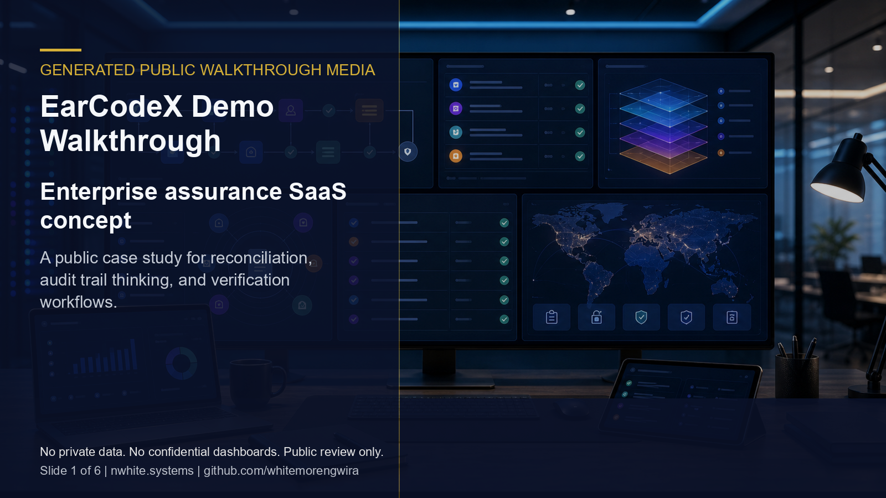

# EarCodeX SaaS Prototype - Portfolio Case Study

**Live artifact:** [https://earcodex.vercel.app/](https://earcodex.vercel.app/)  
**Portfolio role:** SaaS product prototype, enterprise assurance, reconciliation workflow design  
**Source posture:** Sanitized public case study with sensitive product internals kept controlled.

_Generated portfolio visual; not a confidential product screenshot._

_Public live artifact screenshot captured on June 4, 2026._

## Demo Walkthrough

_Generated public walkthrough media using public screenshots and generated portfolio visuals only. It does not show private dashboards, credentials, client records, or sensitive product internals._

## Overview

EarCodeX is a SaaS prototype for enterprise assurance, broker and administrator workflows, reconciliation, verification, and audit-aware operations.

## My Role

I translated regulated workflow complexity into product architecture, public positioning, interface structure, and a reviewable digital prototype.

## What This Demonstrates

- SaaS-style product framing for insurance and enterprise assurance workflows.
- Reconciliation and verification positioning for audit-sensitive operations.
- Public product narrative that demonstrates architecture and delivery judgment without exposing protected internals.

## Technical Proof

- **Stack and delivery signals:** SaaS product framing, reconciliation workflow modeling, audit-aware interface planning, and regulated-sector access-control thinking.
- **Public evidence:** Live artifact, product narrative, verification concepts, and separation between public proof and protected internals.
- **Confidentiality boundary:** This public repo avoids credentials, admin areas, client records, private workflow logic, deployment configuration, and sensitive product internals.

## Public Review Context

The live artifact presents the public product surface. This case study adds product, workflow, and systems-positioning context, while the public demo walkthrough provides a guided overview. The [NWhite Systems Portfolio](https://github.com/whitemorengwira/nwhitesystems) and [one-page recruiter PDF](https://github.com/whitemorengwira/nwhitesystems/blob/main/docs/assets/recruiter-pack/Whitemore-Ngwira-Selected-Systems-Portfolio.pdf) provide broader hiring-review context.

## Confidentiality

This repository does not publish credentials, admin areas, private workflow logic, client data, internal data structures, deployment configuration, or sensitive product internals. Deeper walkthroughs can be provided privately where confidentiality allows.

## Usage Rights

This repository is public for portfolio review only and is not open-source licensed. See [COPYRIGHT.md](COPYRIGHT.md) for usage boundaries.

## Request Walkthrough

Private walkthroughs are available where permissions allow: [hello@nwhite.systems](mailto:hello@nwhite.systems?subject=Portfolio%20walkthrough%20-%20EarCodeX)
