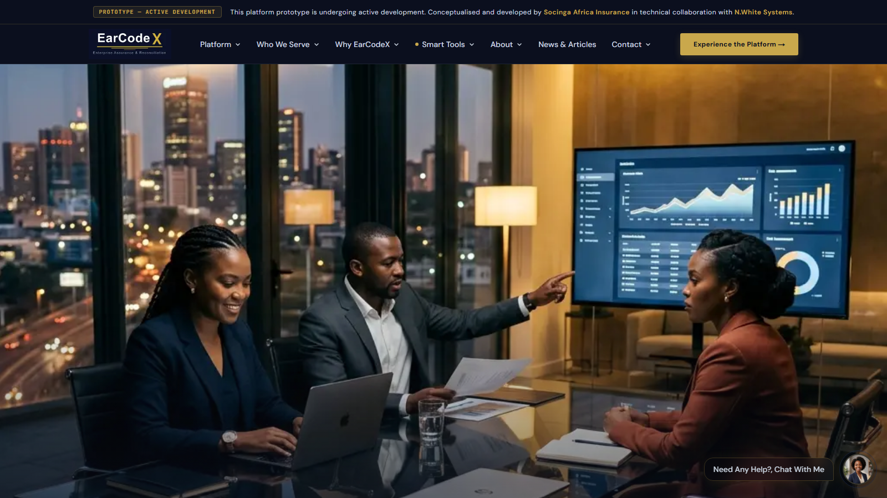

# EarCodeX — Enterprise Insurance Architecture & AI Claims Workflow System
## Cloud Architecture · AI Systems · Insurance Operations · Infrastructure as Code

**Live Public Platform:** [https://earcodex.vercel.app/](https://earcodex.vercel.app/)  
**Primary Cloud Environment:** Amazon Web Services (AWS) + Terraform (IaC)  
**Practice:** [N.White Systems](https://nwhite.systems) — Principal Technology Architect & AI Systems Engineer  

*Figure 1: My enterprise assurance, claims automation, and insurance operating architecture for EarCodeX.*

*Figure 2: EarCodeX public interface demonstration.*

---

## Executive Architectural Summary

I architected and engineered **EarCodeX** as an enterprise assurance, insurance administration, and AI claims automation system designed to modernise regulated insurance operations.

Rather than a surface-level interface, I built EarCodeX as a complete **systems-architecture model** connecting:
\`\`\`
Business Problem → Enterprise Architecture → AWS Cloud Infrastructure → AI Document Intelligence → Claims Automation → Reconciliation → Production Playout
\`\`\`

I designed the system to solve the critical operational bottlenecks of high-volume financial services: broker and member onboarding, document verification, multi-stage claims adjudication, automated financial reconciliation, compliance monitoring, and immutable audit logging.

---

## 🏛️ My Core Architecture Principles

1. **AWS Cloud Foundation**: I built the environment on scalable Amazon Web Services infrastructure using **Terraform (Infrastructure as Code)** for repeatable, multi-environment provisioning (staging, testing, production).
2. **AI-Enabled Claims Automation**: I implemented automated policy cross-referencing, document data extraction, structured information ingestion, and decision-support routing.
3. **Zero-Trust Security & Access Control**: I enforced granular **AWS IAM** role-based access control (RBAC), multi-tenant isolation, and **AWS KMS** customer-managed envelope encryption.
4. **Audit-Aware Reconciliation**: I configured transaction reconciliation and immutable audit trails via **AWS CloudTrail** and **Amazon CloudWatch** for strict regulatory compliance.
5. **Prototype-to-Production Pathway**: I architected the platform from inception with production-grade boundaries, modular microservice boundaries, containerisation (Docker), and declarative CI/CD pipelines.

---

## 🏗️ System Architecture & Workflow Pipeline

\`\`\`
[ Policyholder / Broker ]
           │
           ▼
[ CloudFront CDN / WAF ] ──> DDoS & Managed OWASP Rule Filtering
           │
           ▼
[ Next.js Platform / API Gateway ]
           │
     ┌─────┴────────────────────────────┐
     ▼                                  ▼
[ S3 Document Vault ]          [ AI Ingestion Engine ]
 • KMS Envelope Encryption      • Document Extraction
 • Lifecycle Retention Rules    • Claims Classification & Routing
 • Anti-Tamper Versioning       • Policy Limit Verification
     │                                  │
     └──────────────┬───────────────────┘
                    ▼
     [ Reconciliation & Ledger Layer ]
      • RDS PostgreSQL (Relational)
      • DynamoDB (State & Idempotency)
                    │
                    ▼
     [ Observability & Audit Trail ]
      • CloudWatch Alarms & Metrics
      • CloudTrail Regulatory Audit Log
      • Human-in-the-Loop Sign-off Gate
\`\`\`

---

## 💼 Operating Capabilities

### 1. Insurance Administration & Onboarding
I structured digital intake for brokers, administrators, and policyholders with verified data capture, identity verification, and role-based permissions.

### 2. Intelligent Claims Workflow Automation
I automated first-notice-of-loss (FNOL), evidence document intake (medical invoices, police dockets, repair estimates), claim validation, and exception routing to human adjudicators.

### 3. Financial Reconciliation & Settlement
I built automated reconciliation between broker policy collections, underwriter balances, and claims disbursement ledgers, eliminating manual spreadsheet bottlenecks.

### 4. Regulatory Compliance & Governance
I implemented immutable audit records for every status transition, payment authorisation, and document inspection, ensuring complete compliance readiness.

---

## 🔧 Technology Stack & Infrastructure

* **Primary Cloud Architecture**: Amazon Web Services (AWS)
* **Infrastructure as Code**: HashiCorp Terraform
* **Storage & Encryption**: Amazon S3 (Multi-tier lifecycle), AWS KMS (Customer Managed Keys)
* **Identity & Governance**: AWS IAM (Least-privilege RBAC), AWS CloudTrail
* **Compute & Automation**: AWS Lambda, EventBridge, Docker Containers
* **Databases**: Amazon RDS PostgreSQL, Amazon DynamoDB
* **Monitoring**: Amazon CloudWatch (Metric alarms, access anomalies)
* **Application Framework**: Next.js, React, TypeScript strict mode

---

## ⚖️ Confidentiality & Review Boundary

This public repository serves as a sanitised architectural case study. In accordance with client and regulatory confidentiality agreements:
* Proprietary underwriter pricing matrices, private actuarial datasets, administrative API credentials, and client records are strictly excluded from public display.
* The public platform demonstrates my architectural, workflow, and user interface systems without exposing protected financial institution backend databases.

---

## 🌐 Connected Ecosystem & Practice Review

* **Live Platform Demo**: [https://earcodex.vercel.app/](https://earcodex.vercel.app/)
* **N.White Systems Architecture Review**: [https://nwhite.systems/my-portfolio/earcodex](https://nwhite.systems/my-portfolio/earcodex)
* **Principal Architect Profile**: [https://nwhite.systems/about-me](https://nwhite.systems/about-me)
* **Direct Enquiries**: [hello@nwhite.systems](mailto:hello@nwhite.systems)

---

*© N.White Systems. Engineered for enterprise reliability, governance, and measurable performance.*
